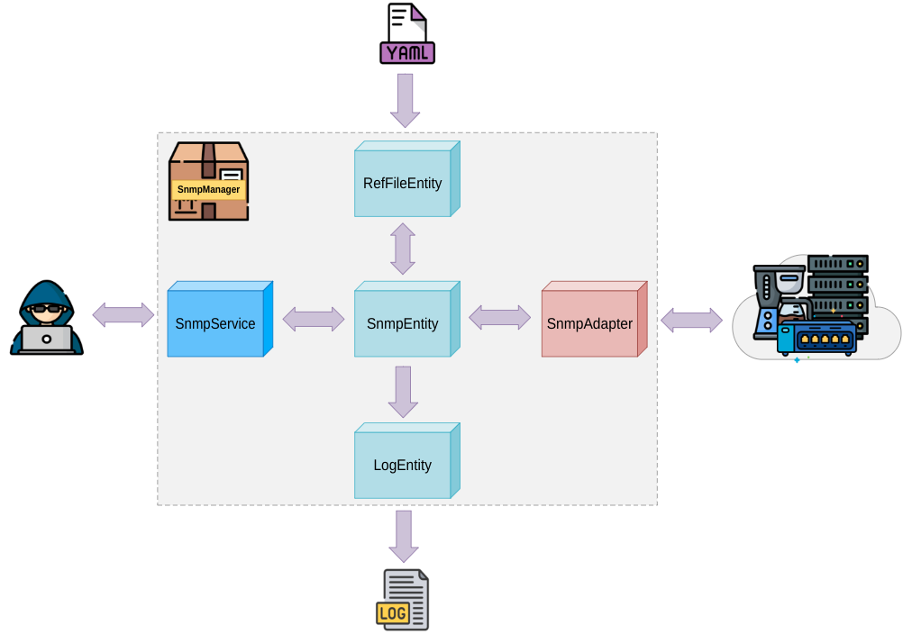

# :shield: snmp-manager

    Este es un paquete para manejar llamadas snmp hacia dispositivos, teniendo las OIDs para cada tipo de ellos almacenadas en archivos yaml

&nbsp;
## :no_entry: Requisitos:

- PHP 8.0 (o superior)
- Laravel 9 (o superior)

&nbsp;
## :package: Instalación:

- Este paso es solo si queres instalar snmp en tu local (indique la version de php que desee):

        sudo apt-get update
        sudo apt-get install php8.1-yaml
        sudo apt-get install php8.1-snmp

- Edite el archivo `composer.json` y añada el siguiente bloque:

        "repositories": [
            {
            "type": "vcs",
            "url": "https://github.com/d4m111/snmpManager.git"
            }
        ]

- `composer require d4m111/snmpManager`

- Agregar al `config/app.php` el provider 

        'providers' => ServiceProvider::defaultProviders()->merge([
            ...
            
            d4m111\SnmpManager\App\Providers\SnmpProvider::class,

        ])->toArray(),

&nbsp;
## :closed_book: Utilización:

- ### :star: Archivos configuración de OIDs:

    - El archivo de config debe estar en formato `.yaml`
    &nbsp;

    - El yaml se separa en 2 secciones principales, las cuales son requeridas:
        &nbsp;
        `META:` Es donde está la definición de que dispositivos pueden usar este archivo sumado a los parametros SNMP generales para todas las OIDs del archivo
        &nbsp;
        `DATA:` Es donde se definen todas las OIDs y sus referencias. Además, se puede definir configuraciones del SNMP para cada una de ellas. **Estas configs pisan a las generales definidas dentro de 'META'**
    &nbsp;

    - **IMPORTANTE**: Asegurese siempre de que el los script tengan permisos para leer los archivo de config creados
    &nbsp;

    ---
        meta:
            vendors: 'SAGEMCOM'     # fabricantes contemplados (puede ser un valor a una lista de valores / vacio significa que acepta a todos)
            not-vendors:            # fabricantes ignorados (puede ser un valor a una lista de valores / vacio significa que no ignora a ninguno)
            models:                 # modelos contemplados
                - 'FAST3686'
            not-models:             # modelos ignorados
            hardwares:              # versiones de hardware contempladas
            not-hardwares:          # versiones de hardware ignorados
            firmwares:              # versiones de firmware contempladas
            not-firmwares:          # versiones de hardware ignorados
            community: "public"     # comunidad snmp para todas las OIDs de archivo. Opcional, Puede no estar
            timeoutMsOnGet: 500000  # timeout (ms) de la consulta snmp para todas las OIDs de archivo. Opcional, Puede no estar
            retriesOnGet: 1         # Reintentos de la consulta snmp para todas las OIDs de archivo. Opcional, Puede no estar
            timeoutMsOnSet: 500000  # timeout (ms) de los seteos snmp para todas las OIDs de archivo. Opcional, Puede no estar
            retriesOnSet: 1         # Reintentos de los seteos snmp para todas las OIDs de archivo. Opcional, Puede no estar
        data:
            uptime: 1.3.6.1.2.1.1.3.0   # se define la referancia de la OID seguido de la OID
            traffic_in:                 # Tambien se puede definir la referencia seguida de las opciones para esta
                oid: '1.3.6.1.2.1.2.2.1.{{index}}}.2'   # se pueden parametrizar diferentes valores de la OID
                tags:                   # listados de nombres que agrupan OIDs. Luego se puede llamar todas las OIDs de un determinado TAG
                    - TRAFFIC
                method: "GET"           # Metodo SNMP. Aceptados: GET/WALK/SET
                format: "PLAIN"         # Formato de la respuesta SNMP - Aceptados: PLAIN/LIBRARY
                community: "public"     # Comunidad SNMP
                timeoutMs: 500000       # Tiempo de espera de la respuesta (milisegundos)
                retries: 1              # reintentos si no se obtiene respuesta
    ---

    &nbsp;
    - Puede haber mas de un archivo de OIDs. Si un dispositivo concide con mas de uno, el paquete tomará el que mas coincidencias tenga.
    &nbsp;

        Ej:

        1°) conf-default.yaml

                meta:
                data:
                    ...

        2°) conf-FAST3686.yaml

                meta:
                    models: 'FAST3686'
                    no-firmwre: 'TLC_28.1.0'
                data:
                    ...

        3°) conf-FAST3686-TLC_30.2.42.yaml
                    
                meta:
                    models: 'FAST3686'
                    firmwre: 'TLC_30.2.42'
                data:
                    ...

        En este caso, hay 3 archivos en donde:
            - un dispositivo con modelo FAST3686 y firmware TLC_30.2.42 tomará el 3°
            - un dispositivo con modelo FAST3686 y firmware TLC_29.1.1 tomará el 2° 
            - un dispositivo con modelo FAST3686 y firmwre TLC_28.1.0 tomará el 1° (no-firmwre) 
            - un dispositivo con modelo DPC2420 y firmware TLC_50.10.11 tomará el 1°
        &nbsp;

 &nbsp;
- ### :star: Métodos de la clase SnmpService:
    ### Configuración para toda la instancia:

        <?php

        $snmp = new d4m111\SnmpManager\App\Services\SnmpService();

        $snmp->config(
            comunity:'private',             // comunidad SNMP (Opcional - default = public)
            timeoutMsOnGet: 500000,         // Tiempo de espera (milisegundos) para alcanza al dispositivo en llamadas GET/WALK. (Opcional - default = 200000) 
            retriesOnGet: 3,                // Reintentos si no alcanza al dispositivo en llamadas GET/WALK. (Opcional - default = 1)
            timeoutMsOnSet: 500000,         // Tiempo de espera (milisegundos) para alcanza al dispositivo en llamadas SET. (Opcional - default = 1000000) 
            retriesOnSet: 3,                // Reintentos si no alcanza al dispositivo en llamadas SET. (Opcional - default = 2) 
            format: 'LIBRARY',              // Formato de la respuesta en llamadas GET/WALK - Aceptados: PLAIN/LIBRARY (Opcional - default = PLAIN)
            oidFilesPath: 'storage/app',    // ruta relativa dentro del proyecto laravel donde se buscarán los archivos de config (.yaml) - default = carpeta raiz del proyecto
            deviceOidCacheMaxLen: 20,       // cantidad de archivos de dispositivos que se cachearán en memoria para evitar consultarlo en disco  (Opcional - default = 10)   
            logChannel: 'single'            // Nombre del channel de laravel donde se escribirán los logs internos del paquete
            logParams: ['type','ip']        // paramteros que se loguearán si se definió el 'logChannel'. (Opcional - por defecto loguea todos ['method','ip','ref','oid','val','resp','delay,'isok','class','code','error']) 
        );
        
    &nbsp;
    La configuración definida aquí es la de menor jerarquía. Será pisada por las definidas en los archivos de config (.yaml); y estas, a su vez, serán pisadas por las definidas en los métodos get()/getByRef()/walk()/walkByRef()/set()/setByRef()/iterateByRef() al ser llamados.
    
    &nbsp;
    En caso de haber definido un channel de log en el parametro `logChannel`, cada linea de log se verá de esta manera:

    storage/logs/laravel.log
    > [2024-08-20 12:48:08] laravel.INFO:  {"foo":"bar"} 

    &nbsp;
    En caso que desee que se vea completamente en formato json, debe agragar a la config del channel el parametro 'tap' haciendo referencia al formatter para json que provee el paquete.

    config/logging.php

        'single' => [
            'driver' => 'single',
            'tap' => [d4m111\SnmpManager\App\Utils\JsonFormatter::class],
            ...

    storage/logs/laravel.log
    > {"date":"2024-08-20 12:56:00","severity":"INFO","foo":"bar"}

    &nbsp;
    ### SNMP Get:

    Realiza un SNMP GET sobre una OID dada.       
    &nbsp;

        <?php

        $snmp = new d4m111\SnmpManager\App\Services\SnmpService();

        $r = $snmp->get(
            ip: '10.16.208.47',             // IP del dispositivo (Requerido)
            oid: '1.3.6.1.4.1.4413.2.2.2.1.18.1.2.1.1.3.{{interface}}',  // OID a consultar (Requerido)
            format: 'LIBRARY',              // Formato de la respuesta - Aceptados: PLAIN/LIBRARY (Opcional - default = PLAIN)
            comunity:'private',             // comunidad SNMP (Opcional - default = public)
            timeoutMs: 500000,              // Tiempo de espera (milisegundos) para alcanza al dispositivo. (Opcional - default = 200000) 
            retries: 3,                     // reintentos si no alcanza al dispositivo. (Opcional - default = 1)
            oidParams: ['interface' => 10001],     // Parametros a reemplazar en la oid (Opcional - default = [])
            unreachableException: true,     // Lanza excepción si no alcanza al dispositivo. (Opcional - default = false)
            customLogParams: ['techZone' => 'CA30'] // listado de parametros que pueden ser agragado al log (Opcional). Si se definió un listado de parametro en el atributo 'logParams' del método config(), este nuevo parametro tambien debe ser agragado ahí.
        );
    &nbsp;

        // respuesta:
        // "nombre-ssid-prueba"

    &nbsp;
    ### SNMP Get por referencia:

    Realiza un SNMP GET a una referenacia de OID del archivo de config correspondiente.
    &nbsp;

    En el archivo de config se pueden pueden parametrizar indices de las OIDs, que luego son pasados al llamarlas. 
    Esta funcionalidad puede usarse en todos los metodos: get()/getByRef()/walk()/walkByRef()/set()/setByRef()/iterateByRef().

    &nbsp;
    conf-FAST3686.yaml (el nombre que se use en el rachivo de config es irrelebante)

        meta:
            models: 'FAST3686'
        data:
            ssid_24: 1.3.6.1.4.1.4413.2.2.2.1.18.1.2.1.1.3.{{interface}}

        <?php

    &nbsp;

        $snmp = new d4m111\SnmpManager\App\Services\SnmpService();

        $r = $snmp->getByRef(
            ip: '10.16.208.47',             // IP del dispositivo (Requerido)
            oidRef: 'ssid_24',              // Referancia a OID dentro de archivos de config (Requerido)
            // vendor:                      // Fabricante del dispositivo (Opcional - default = vacio, osea que acepta cualquiera)
            model: 'FAST3686',              // Modelo del dispositivo (Opcional - default = vacio, osea que acepta cualquiera)
            // hardware:'v123',             // Versión de hardware del dispositivo (Opcional - default = vacio, osea que acepta cualquiera)
            // firmware:                    // Versión de firmware del dispositivo (Opcional - default = vacio, osea que acepta cualquiera)
            format: 'LIBRARY',              // Formato de la respuesta - Aceptados: PLAIN/LIBRARY (Opcional - default = PLAIN)
            comunity:'private',             // comunidad SNMP (Opcional - default = public)
            timeoutMs: 500000,              // Tiempo de espera (milisegundos) para alcanza al dispositivo. (Opcional - default = 200000) 
            retries: 3,                     // reintentos si no alcanza al dispositivo. (Opcional - default = 1) 
            oidParams: ['interface' => 10001],  // Parametros a reemplazar en la oid definida en el archivo de config  (Opcional - default = [])
            unreachableException: true,     // Lanza excepción si no alcanza al dispositivo. (Opcional - default = false)
            customLogParams: ['techZone' => 'CA30'] // listado de parametros que pueden ser agragado al log (Opcional). Si se definió un listado de parametro en el atributo 'logParams' del método config(), este nuevo parametro tambien debe ser agragado ahí.
        );

    En este caso se buscará un archivo de config que contenga el modelo 'FAST3686' y la version de hardware 'v123', o los tenga vacios. Sin importar que fabricante ni version de firmware definidos en el archivo de config. 
        Esto es igual para todos los metodos que usen referencia del archivo de config: getByRef()/walkByRef()/setByRef()/iterateByRef().
    &nbsp;

        // respuesta:
        // "nombre-ssid-prueba"

    &nbsp;
    ### SNMP Walk:

    Realiza un SNMP WALK sobre una OID dada.
    &nbsp;

        <?php

        $snmp = new d4m111\SnmpManager\App\Services\SnmpService();

        $r = $snmp->get(                    // Siempre retorna un array
            ip: '10.16.208.47',             // IP del dispositivo (Requerido)
            oid: '1.3.6.1.2.1.2.2.1.{{index}}}.2',  // OID a consultar (Requerido)
            format: 'LIBRARY',              // Formato de la respuesta - Aceptados: PLAIN/LIBRARY (Opcional - default = PLAIN)
            comunity:'private',             // comunidad SNMP (Opcional - default = public)
            timeoutMs: 500000,              // Tiempo de espera (milisegundos) para alcanza al dispositivo. (Opcional - default = 200000) 
            retries: 3,                     // reintentos si no alcanza al dispositivo. (Opcional - default = 1)
            oidParams: ['index' => 10],     // Parametros a reemplazar en la oid
            //oidAsIndex = false,            // Indica si el indice del array devuelto tiene la oid o si es numerico incremental. (Opcional - default = true)
            unreachableException: true,     // Lanza excepción si no alcanza al dispositivo. (Opcional - default = false)
            customLogParams: ['techZone' => 'CA30'] // listado de parametros que pueden ser agragado al log (Opcional). Si se definió un listado de parametro en el atributo 'logParams' del método config(), este nuevo parametro tambien debe ser agragado ahí.

    &nbsp;

        // respuesta:
        //
        // Con param: oidAsIndex = true 
        // [
        //    'iso.3.6.1.2.1.2.2.1.10.2' => '27501975'
        // ]
        // 
        // Con param: oidAsIndex = false 
        // [ 
        //    0 => '27501975'
        // ]
    &nbsp;
    ### SNMP Walk por referencia:

    Realiza un SNMP WALK a una referenacia de OID del archivo de config correspondiente.
    &nbsp;

        <?php

        $snmp = new d4m111\SnmpManager\App\Services\SnmpService();

        $r = $snmp->getByRef(               // Siempre retorna un array
            ip: '10.16.208.47',             // IP del dispositivo (Requerido)
            oidRef: 'traffic_in',           // Referancia a OID dentro de archivos de config (Requerido)
            // vendor:                      // Fabricante del dispositivo (Opcional - default = vacio, osea que acepta cualquiera)
            model: 'FAST3686',              // Modelo del dispositivo (Opcional - default = vacio, osea que acepta cualquiera)
            hardware:'v123'                 // Versión de hardware del dispositivo (Opcional - default = vacio, osea que acepta cualquiera)
            // firmware:                    // Versión de firmware del dispositivo (Opcional - default = vacio, osea que acepta cualquiera)
            format: 'LIBRARY',              // Formato de la respuesta - Aceptados: PLAIN/LIBRARY (Opcional - default = PLAIN)
            comunity:'private',             // comunidad SNMP (Opcional - default = public)
            timeoutMs: 500000,              // Tiempo de espera (milisegundos) para alcanza al dispositivo. (Opcional - default = 200000) 
            retries: 3,                     // reintentos si no alcanza al dispositivo. (Opcional - default = 1) 
            oidParams: ['index' => 10],     // Parametros a reemplazar en la oid definida en el archivo de config  (Opcional - default = [])
            //oidAsIndex = false,            // Indica si el indice del array devuelto tiene la oid o si es numerico incremental. (Opcional - default = true)
            unreachableException: true,     // Lanza excepción si no alcanza al dispositivo. (Opcional - default = false)
            customLogParams: ['techZone' => 'CA30'] // listado de parametros que pueden ser agragado al log (Opcional). Si se definió un listado de parametro en el atributo 'logParams' del método config(), este nuevo parametro tambien debe ser agragado ahí.
        );

    &nbsp;

        // respuesta:
        //
        // Con param: oidAsIndex = true 
        // [
        //    'iso.3.6.1.2.1.2.2.1.10.2' => '27501975'
        // ]
        // 
        // Con param: oidAsIndex = false 
        // [ 
        //    0 => '27501975'
        // ]

    &nbsp;
    ### SNMP Set:

    Realiza un SNMP SET sobre una OID dada.
    &nbsp;

        <?php

        $snmp = new d4m111\SnmpManager\App\Services\SnmpService();

        $r = $snmp->set(                    // retorna un booleano o un null. FALSE en caso de que haya habido error, TRUE si no lo hubo y null si no pudo alcanzarlo
            ip: '10.16.208.47',             // IP del dispositivo (Requerido)
            oid: '1.3.6.1.2.1.2.2.1.{{index}}}.2',  // OID a llamar. puede recibir parametros definidos en 'oidParams' (Requerido)
            type: 's',                      // tipo de valor (Requerido - permitidos: i,u,s,x,d,n,o,t,a,b,U,I,F,D) 
            value : 'valor',                // valor a setear (Requerido - acepta valores: int/float/string)
            comunity:'private',             // comunidad SNMP (Opcional - default = public)
            timeoutMs: 500000,              // Tiempo de espera (milisegundos) para que responda el dispositivo. (Opcional - default = 200000) 
            retries: 3,                     // reintentos si no alcanza al dispositivo. (Opcional - default = 1)
            oidParams: ['index' => 10],     // Parametros a reemplazar en la oid
            unreachableException: true,     // Lanza excepción si no alcanza al dispositivo. (Opcional - default = false)
            customLogParams: ['techZone' => 'CA30'] // listado de parametros que pueden ser agragado al log (Opcional). Si se definió un listado de parametro en el atributo 'logParams' del método config(), este nuevo parametro tambien debe ser agragado ahí.
        );

        &nbsp;

            // respuesta:
            // true 

    &nbsp;
    ### SNMP Set por referencia:

    Realiza un SNMP SET a una referenacia de OID del archivo de config correspondiente.
    &nbsp;

        <?php

        $snmp = new d4m111\SnmpManager\App\Services\SnmpService();

        $r = $snmp->setByRef(               // retorna un booleano o un null. FALSE en caso de que haya habido error, TRUE si no lo hubo y null si no pudo alcanzarlo
            ip: '10.16.208.47',             // IP del dispositivo (Requerido)
            oidRef: 'traffic_in',           // Referancia a OID dentro de archivos de config (Requerido)
            type: 's',                      // tipo de valor (Requerido - permitidos: i,u,s,x,d,n,o,t,a,b,U,I,F,D) 
            value : 'valor',                // valor a setear (Requerido - acepta valores: int/float/string)
            // vendor:                      // Fabricante del dispositivo (Opcional - default = vacio, osea que acepta cualquiera)
            model: 'FAST3686',              // Modelo del dispositivo (Opcional - default = vacio, osea que acepta cualquiera)
            hardware:'v123',                // Versión de hardware del dispositivo (Opcional - default = vacio, osea que acepta cualquiera)
            // firmware:                    // Versión de firmware del dispositivo (Opcional - default = vacio, osea que acepta cualquiera)
            comunity:'private',             // comunidad SNMP (Opcional - default = public)
            timeoutMs: 500000,              // Tiempo de espera (milisegundos) para alcanza al dispositivo. (Opcional - default = 200000) 
            retries: 3,                     // reintentos si no alcanza al dispositivo. (Opcional - default = 1) 
            // oidParams: ['index' => 10],  // Parametros a reemplazar en la oid definida en el archivo de config  (Opcional - default = [])
            unreachableException: true,     // Lanza excepción si no alcanza al dispositivo. (Opcional - default = false)
            customLogParams: ['techZone' => 'CA30'] // listado de parametros que pueden ser agragado al log (Opcional). Si se definió un listado de parametro en el atributo 'logParams' del método config(), este nuevo parametro tambien debe ser agragado ahí.
        );

    &nbsp;

        // respuesta:
        // true 

    &nbsp;
    ### SNMP Iterate:

    Itera sobre una lista de referencias de OIDs del archivo de config correspondiente, ejecutando las llamadas GET/WALK/SET indicadas en cada referencia de OID.
    &nbsp;

    conf-FAST3686.yaml (el nombre que se use en el rachivo de config es irrelebante)

        meta:
            models: 'FAST3686'
        data:
            uptime: '1.3.6.1.2.1.1.3.0'
            traffic_in: 
                oid: '1.3.6.1.2.1.2.2.1.10.2'
                method: "WALK"
            ssid_24: 
                oid: '1.3.6.1.4.1.4413.2.2.2.1.18.1.2.1.1.3.10001'
                method: 'SET'
                type: 's'
                value: 'ssid-test'

    &nbsp;

        <?php

        $snmp = new d4m111\SnmpManager\App\Services\SnmpService();

        $r = $snmp->iterateByRef(
            ip: '10.16.208.47',             // IP del dispositivo (Requerido)
            // oidRefsList: ['traffic_in'], // Lista de referancias a OIDs dentro de archivos de config (Opcional - default = vacio, osea recorre todas las referencias)
            // ignoreOidRefsList: ['ssid_24'], // Lista de referancias a OIDs dentro de archivos de config a ignorar (Opcional - default = vacio, osea no ignora ninguna referencia)
            // tagsList : ['TRAFFIC'],         // Lista de tags definidos dentro de archivos de config (Opcional - default = vacio)
            // vendor:                      // Fabricante del dispositivo (Opcional - default = vacio, osea que acepta cualquiera)
            model: 'FAST3686',              // Modelo del dispositivo (Opcional - default = vacio, osea que acepta cualquiera)
            // hardware:'v123'                 // Versión de hardware del dispositivo (Opcional - default = vacio, osea que acepta cualquiera)
            // firmware:                    // Versión de firmware del dispositivo (Opcional - default = vacio, osea que acepta cualquiera)
            oidRefIsAlive:'uptime',         // Referancia a OID dentro de archivos de config que se consultará primero para saber si el dispositivo responde SNMP
            unreachableTimesBreak: 2,       // Indica en cuantas veces consecutivas que el dispositivo sea inaccesible se eperarán para dejar de consultar las OIDs restantes del listado
            unreachableException: true,     // Lanza excepción si no alcanza al dispositivo. (Opcional - default = false)
            //oidAsIndexOnWalk: false,      // Indica si el indice del array devuelto tiene la oid o si es numerico incremental. (Opcional - default = true)
            bool $allowSet = false,         // Si no esta activo, ignora todas la referencias del archivo de config que tengan SET como método. (Opcional - default = false)
            customLogParams: ['techZone' => 'CA30']    // listado de parametros que pueden ser agragado al log (Opcional). Si se definió un listado de parametro en el atributo 'logParams' del método config(), este nuevo parametro tambien debe ser agragado ahí.              
            
            preProcess: function(           // Recibe una función que será ejecutada antes de la llamada SNMP. Esta retorna los paramtros que luego serán usados en la llamada SNMP de esa iteración. (Opcional - default = null)
                $ix,                        // Contiene el indice numerico de la iteración actual
                $oidRef,                    // Contiene la referencia que será llamada en esta iteración
                $fileParams                 // Parametros (method,format,comunity,etc) definido en el archivo de referencias
                $lastSnmpResp,              // Contiene la la respuesta SNMP recibida en la iteración anterior
                $snmpRespList,              // Lista de todas las respuestas SNMP recibidas hasta el momento
            )
            {
                return [                               // Puedo pisar los parametros definidos en el archivo de referencias
                    // 'method' => 'GET'               // Metodo a ejecutar - Aceptados: GET/WALK/SET (Opcional - default = null)
                    // 'format' => 'LIBRARY',          // Formato de la respuesta - Aceptados: PLAIN/LIBRARY (Opcional - default = PLAIN)
                    // 'comunity' => 'private',        // comunidad SNMP (Opcional - default = public)
                    // 'timeoutMs' => 500000,          // Tiempo de espera (milisegundos) para alcanza al dispositivo. (Opcional - default = 200000) 
                    // 'retries' => 3,                 // reintentos si no alcanza al dispositivo. (Opcional - default = 1) 
                    // 'type' => 's',                  // tipo de valor (Requerido - permitidos: i,u,s,x,d,n,o,t,a,b,U,I,F,D) 
                    // 'value' => 'valor',             // valor a setear (Requerido - acepta valores: int/float/string)
                    // 'oidParams' => ['index' => 10], // Parametros a reemplazar en la oid definida en el archivo de config  (Opcional - default = [])
                    // 'customLogParams' => ['techZone' => 'CA30'] // listado de parametros que pueden ser agragado al log (Opcional). Si se definió un listado de parametro en el atributo 'logParams' del método config(), este nuevo parametro tambien debe ser agragado ahí.
                ];
            },

            postProcess: function(          // Recibe una función que será ejecutada luego de la llamada SNMP. (Opcional - default = null)
                ix,                         // Contiene el indice numerico de la iteración actual
                $oidRef,                    // Contiene la referencia que será llamada en esta iteración
                $fileParams                 // Parametros (method,format,comunity,etc) definido en el archivo de referencias o en la función 'preProcess'
                $snmpResp,                  // Contiene la la respuesta SNMP recibida en esta iteración
                $SnmpRespList,              // Lista de todas las respuestas SNMP recibidas hasta el momento
                $deviceIsAlive,             // Booleano que indica si se pudo alcanzar el dispositivo
                $delay,                     // demora en segundo que se demoró la respuesta
                $error,                     // Contiene un booleano que indica si hubo una excepación de la llamada SNMP
                $errorCode,                 // Contiene el código de la excepación de la llamada SNMP, en caso de haberla habido
                $errorMessage,              // Contiene el mensaje de la excepación de la llamada SNMP, en caso de haberla habido
            )
            {
                // return false;            // si se reetorna un booleano 'FALSE' se detiene la recorrida del archivo de config
            }
        );

    &nbsp;

        //  respuesta:
        //  [
        //      "uptime" => "246145300",                            // Respuesta del GET
        //      "traffic_in" => [
        //          'iso.3.6.1.2.1.2.2.1.10.2' => "27501975"        // Respuesta del WALK
        //      ],
        //      "ssid_24" => true                                   // Respuesta del SET
        //  ]

    &nbsp;
    ### Get OID list 

    Obtiene un listado de OIDs de un dispositivo con un formato estandard en base a las referencias dadas
    &nbsp;

        <?php

        $snmp = new d4m111\SnmpManager\App\Services\SnmpService();

        $r = $snmp->getOidRefListsByDevice(
            oidRefsList: ['traffic_in'],    // Lista de referancias a OIDs dentro de archivos de config (Opcional - default = vacio, osea recorre todas las referencias)
            // ignoreOidRefsList: ['ssid_24'], // Lista de referancias a OIDs dentro de archivos de config a ignorar (Opcional - default = vacio, osea no ignora ninguna referencia)
            tagsList : ['TRAFFIC'],         // Lista de tags definidos dentro de archivos de config (Opcional - default = vacio)
            // vendor:                      // Fabricante del dispositivo (Opcional - default = vacio, osea que acepta cualquiera)
            model: 'FAST3686',              // Modelo del dispositivo (Opcional - default = vacio, osea que acepta cualquiera)
            hardware:'v123'                 // Versión de hardware del dispositivo (Opcional - default = vacio, osea que acepta cualquiera)
            // firmware:                    // Versión de firmware del dispositivo (Opcional - default = vacio, osea que acepta cualquiera)
        );

    Siempre retorna todos los campos aunque no se hayan definido en el archivos de config (.yaml). Además, completa lo que no se haya definido para cada referencia con lo asignado en `config()` y en las seccion `META` del archivos de config. 

    **IMPORTANTE:** No hace el llamado SNMP, solo devuelve la información del archivos de config (.yaml) para que luego sea utilizado como se desee    
    &nbsp;

        // respuesta:
        // [
        //     "traffic_in" => [
        //         "oid" => "1.3.6.1.2.1.2.2.1.{{index}}.2",
        //         "method" => "GET",
        //         "format" => "PLAIN",
        //         "comunity" => NULL,
        //         "timeoutMs" => 500000,
        //         "retries" => 1,
        //         "type" => NULL,
        //         "value" => NULL
        //     ]
        // ]

 &nbsp;
- ### :star: Commands del paquete:

    `snmp:get`

    |Param| Detalle |
    |--|--|
    | `-i --ip=` | IP del dispositivo a consultar |
    | `-o --oid=` | OID |
    | `-r --ref=` | Nombre de referencia para la OID |
    | `-x --vendor=` | Fabricante del dispositivo a consulta |
    | `-m --model=` | Modelo del dispositivo a consultar |
    | `-d --hardware=` | Versión de hardware del dispositivo a consultar |
    | `-w --firmware=` | Versión de firmware del dispositivo a consultar |
    | `-f --format=` |  Formato de la respuesta PLAIN/LIBRARY |
    | `-c --comunity=` | Comunidad SNMP |
    | `-t --timeout=` | Timeout de la consulta en milisegundos |
    | `-r --retries=` | Cantidad de reintentos para la consulta |
    | `-p --params=` | Parametros en formato JSON para reemplazar en la OID |

    Ejemplo:

        php artisan snmp:get --ip=10.16.141.17 --ref=ssid_24 --model=FAST3686 --hardware=123
        
        Respuesta:
        +-----------+---------------------------------------------+----------+-------------+
        | Reference | OID                                         | Response | Delay (sec) |
        +-----------+---------------------------------------------+----------+-------------+
        | ssid_24   | 1.3.6.1.4.1.4413.2.2.2.1.18.1.2.1.1.3.10001 |test      | 0.40        |
        +-----------+---------------------------------------------+----------+-------------+

        php artisan snmp:get --ip=10.16.141.17 --oid=1.3.6.1.4.1.4413.2.2.2.1.18.1.2.1.1.3.10001

        Respuesta:
        +-----------+---------------------------------------------+----------+-------------+
        | Reference | OID                                         | Response | Delay (sec) |
        +-----------+---------------------------------------------+----------+-------------+
        |           | 1.3.6.1.4.1.4413.2.2.2.1.18.1.2.1.1.3.10001 |test      | 0.40        |
        +-----------+---------------------------------------------+----------+-------------+

    &nbsp;

    `snmp:walk`

    |Param| Detalle |
    |--|--|
    | `-i --ip=` | IP del dispositivo a consultar |
    | `-o --oid=` | OID |
    | `-r --ref=` | Nombre de referencia para la OID |
    | `-x --vendor=` | Fabricante del dispositivo a consulta |
    | `-m --model=` | Modelo del dispositivo a consultar |
    | `-d --hardware=` | Versión de hardware del dispositivo a consultar |
    | `-w --firmware=` | Versión de firmware del dispositivo a consultar |
    | `-f --format=` |  Formato de la respuesta PLAIN/LIBRARY |
    | `-c --comunity=` | Comunidad SNMP |
    | `-t --timeout=` | Timeout de la consulta en milisegundos |
    | `-r --retries=` | Cantidad de reintentos para la consulta |
    | `-p --params=` | Parametros en formato JSON para reemplazar en la OID |

    Ejemplo:

        php artisan snmp:walk --ip=10.16.208.47 --ref=ssid_list --model=FAST3686 --hardware=123

        Respuesta:
        +-----------+---------------------------------------------------+---------------------+-------------+
        | Reference | OID                                               | Response            | Delay (sec) |
        +-----------+---------------------------------------------------+---------------------+-------------+
        | ssid_list | 1.3.6.1.4.1.4413.2.2.2.1.18.1.2.1.1.3             |                     | 0.51        |
        |           |  |_ iso.3.6.1.4.1.4413.2.2.2.1.18.1.2.1.1.3.10001 | test                |             |
        |           |  |_ iso.3.6.1.4.1.4413.2.2.2.1.18.1.2.1.1.3.10002 | testing             |             |
        |           |  |_ iso.3.6.1.4.1.4413.2.2.2.1.18.1.2.1.1.3.10003 | test Wifi           |             |
        |           |  |_ iso.3.6.1.4.1.4413.2.2.2.1.18.1.2.1.1.3.10004 | test-d22f_0_3       |             |
        |           |  |_ iso.3.6.1.4.1.4413.2.2.2.1.18.1.2.1.1.3.10101 | test                |             |
        |           |  |_ iso.3.6.1.4.1.4413.2.2.2.1.18.1.2.1.1.3.10102 | test-d22f_1_1       |             |
        |           |  |_ iso.3.6.1.4.1.4413.2.2.2.1.18.1.2.1.1.3.10103 | test Wifi           |             |
        |           |  |_ iso.3.6.1.4.1.4413.2.2.2.1.18.1.2.1.1.3.10104 | test-d22f_1_3       |             |
        |           |  |_ iso.3.6.1.4.1.4413.2.2.2.1.18.1.2.1.1.3.10105 | test-d22f-BH        |             |
        +-----------+---------------------------------------------------+---------------------+-------------+

        php artisan snmp:walk --ip=10.16.141.17 --oid=1.3.6.1.4.1.4413.2.2.2.1.18.1.2.1.1.3

        Respuesta:
        +-----------+---------------------------------------------------+---------------------+-------------+
        | Reference | OID                                               | Response            | Delay (sec) |
        +-----------+---------------------------------------------------+---------------------+-------------+
        |           | 1.3.6.1.4.1.4413.2.2.2.1.18.1.2.1.1.3             |                     | 0.58        |
        |           |  |_ iso.3.6.1.4.1.4413.2.2.2.1.18.1.2.1.1.3.10001 | test                |             |
        |           |  |_ iso.3.6.1.4.1.4413.2.2.2.1.18.1.2.1.1.3.10002 | testing             |             |
        |           |  |_ iso.3.6.1.4.1.4413.2.2.2.1.18.1.2.1.1.3.10003 | test Wifi           |             |
        |           |  |_ iso.3.6.1.4.1.4413.2.2.2.1.18.1.2.1.1.3.10004 | test-d22f_0_3       |             |
        |           |  |_ iso.3.6.1.4.1.4413.2.2.2.1.18.1.2.1.1.3.10101 | test                |             |
        |           |  |_ iso.3.6.1.4.1.4413.2.2.2.1.18.1.2.1.1.3.10102 | test-d22f_1_1       |             |
        |           |  |_ iso.3.6.1.4.1.4413.2.2.2.1.18.1.2.1.1.3.10103 | test Wifi           |             |
        |           |  |_ iso.3.6.1.4.1.4413.2.2.2.1.18.1.2.1.1.3.10104 | test-d22f_1_3       |             |
        |           |  |_ iso.3.6.1.4.1.4413.2.2.2.1.18.1.2.1.1.3.10105 | test-d22f-BH        |             |
        +-----------+---------------------------------------------------+---------------------+-------------+

    &nbsp;

    `snmp:set`

    |Param| Detalle |
    |--|--|
    | `-i --ip=` | IP del dispositivo a consultar |
    | `-o --oid=` | OID |
    | `-r --ref=` | Nombre de referencia para la OID |
    | `-t --type=` |  tipo de valor enviado - permitidos: i,u,s,x,d,n,o,t,a,b,U,I,F,D |
    | `-a --value=` |  Valor enviado |
    | `-x --vendor=` | Fabricante del dispositivo a consulta |
    | `-m --model=` | Modelo del dispositivo a consultar |
    | `-d --hardware=` | Versión de hardware del dispositivo a consultar |
    | `-w --firmware=` | Versión de firmware del dispositivo a consultar |
    | `-c --comunity=` | Comunidad SNMP |
    | `-t --timeout=` | Timeout de la consulta en milisegundos |
    | `-r --retries=` | Cantidad de reintentos para la consulta |
    | `-p --params=` | Parametros en formato JSON para reemplazar en la OID |

    Ejemplo:

        php artisan snmp:set --ip=10.16.141.17 --ref=ssid_24 --model=FAST3686 --hardware=123 --type=s --value=testing

        Respuesta:
        +-----------+---------------------------------------------+----------+-------------+
        | Reference | OID                                         | Response | Delay (sec) |
        +-----------+---------------------------------------------+----------+-------------+
        | ssid_24   | 1.3.6.1.4.1.4413.2.2.2.1.18.1.2.1.1.3.10001 | 1        | 0.08        |
        +-----------+---------------------------------------------+----------+-------------+

        php artisan snmp:set --ip=10.16.141.17 --oid=1.3.6.1.4.1.4413.2.2.2.1.18.1.2.1.1.3.10001 --type=s --value=testing

        Respuesta:
        +-----------+---------------------------------------------+----------+-------------+
        | Reference | OID                                         | Response | Delay (sec) |
        +-----------+---------------------------------------------+----------+-------------+
        |           | 1.3.6.1.4.1.4413.2.2.2.1.18.1.2.1.1.3.10001 | 1        | 0.10        |
        +-----------+---------------------------------------------+----------+-------------+

    &nbsp;

    `snmp:iterate`

    |Param| Detalle |
    |--|--|
    | `-i --ip=` | IP del dispositivo a consultar |
    | `-r --refs=` | Listado de referencias de OIDs separadas por comas |
    | `-r --ignorerefs=` | Listado de referencias de OIDs a ignorar separadas por comas |
    | `-a --tags=` | Listado de tags separadas por comas |
    | `-x --vendor=` | Fabricante del dispositivo a consulta |
    | `-m --model=` | Modelo del dispositivo a consultar |
    | `-d --hardware=` | Versión de hardware del dispositivo a consultar |
    | `-w --firmware=` | Versión de firmware del dispositivo a consultar |
    | `-f --format=` |  Formato de la respuesta PLAIN/LIBRARY |
    | `-c --comunity=` | Comunidad SNMP |
    | `-t --timeout=` | Timeout de la consulta en milisegundos |
    | `-r --retries=` | Cantidad de reintentos para la consulta |
    | `-u --unreachabletimes=` | Cantidad de veces consecutivas que el dispositivo sea inaccesible se eperarán para dejar de consultarlo |
    | `-r --allowset` | Habilita la posibilidad de procesar las referencias definidas con el método SET |

    Ejemplo:

        php artisan snmp:iterate --ip=10.16.141.17 --model=FAST3686 --hardware=123

        Respuesta:
        +------------+---------------------------------------------------+---------------------+-------------+
        | Reference  | OID                                               | Response            | Delay (sec) |
        +------------+---------------------------------------------------+---------------------+-------------+
        | uptime     | 1.3.6.1.2.1.1.3.0                                 | 351654000           | 0.04        |
        | traffic_in | 1.3.6.1.2.1.2.2.1.10.2                            | 4114842831          | 0.12        |
        | ssid_list  | 1.3.6.1.4.1.4413.2.2.2.1.18.1.2.1.1.3             |                     | 1.18        |
        |            |  |_ iso.3.6.1.4.1.4413.2.2.2.1.18.1.2.1.1.3.10001 | test                |             |
        |            |  |_ iso.3.6.1.4.1.4413.2.2.2.1.18.1.2.1.1.3.10002 | testing             |             |
        |            |  |_ iso.3.6.1.4.1.4413.2.2.2.1.18.1.2.1.1.3.10003 | test Wifi           |             |
        |            |  |_ iso.3.6.1.4.1.4413.2.2.2.1.18.1.2.1.1.3.10004 | test-d22f_0_3       |             |
        |            |  |_ iso.3.6.1.4.1.4413.2.2.2.1.18.1.2.1.1.3.10101 | test                |             |
        |            |  |_ iso.3.6.1.4.1.4413.2.2.2.1.18.1.2.1.1.3.10102 | test-d22f_1_1       |             |
        |            |  |_ iso.3.6.1.4.1.4413.2.2.2.1.18.1.2.1.1.3.10103 | test Wifi           |             |
        |            |  |_ iso.3.6.1.4.1.4413.2.2.2.1.18.1.2.1.1.3.10104 | test-d22f_1_3       |             |
        |            |  |_ iso.3.6.1.4.1.4413.2.2.2.1.18.1.2.1.1.3.10105 | test-d22f-BH        |             |
        | ssid_24    | 1.3.6.1.4.1.4413.2.2.2.1.18.1.2.1.1.3.10001       | SET_NOT_ALLOWED     | 0.00        |
        | guardar    | 1.3.6.1.4.1.4413.2.2.2.1.18.1.1.1.0               | SET_NOT_ALLOWED     | 0.00        |
        +------------+---------------------------------------------------+---------------------+-------------+
    
    &nbsp;
## :building_construction: Arquitectura:

